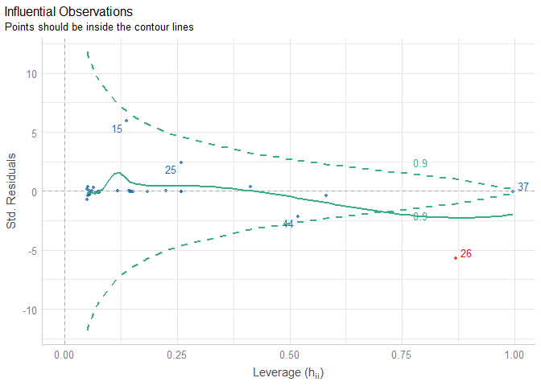

Outlier is a value that lie far from the rest or abnormal distance from the others.Before performing any analysis it is advisable to check for presence of outliers.Influencial points do largely skew the distribution of a set of data and it is good to perform analysis with and without outliers for proper comparison.

We are going to try and visualize presence of influencial points using a package called `performance`


```r
#required library
library(performance)
library(see)
library(ggplot2)
```


```r
#model creation

model<-lm(brainwt~vore*bodywt,data = ggplot2::msleep)
```


```r
#checking for outliers
plot(check_outliers(model))
```

<!-- -->

